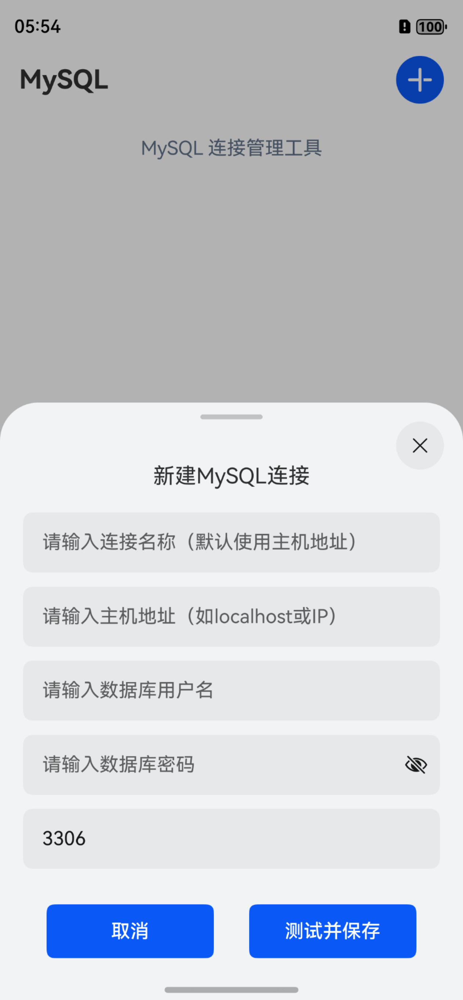
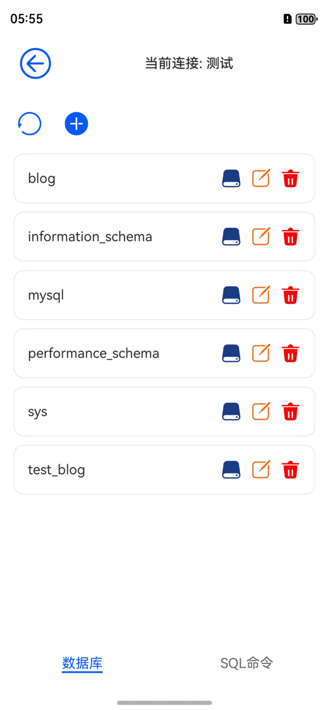
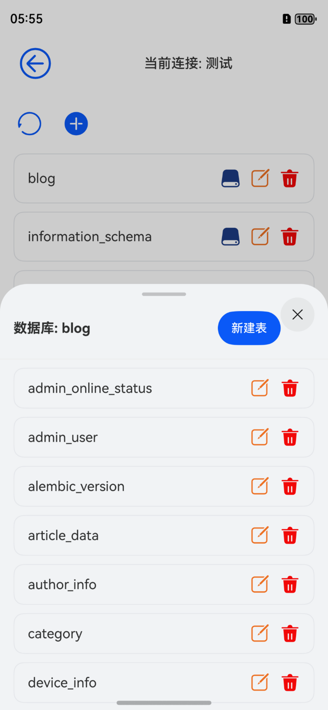
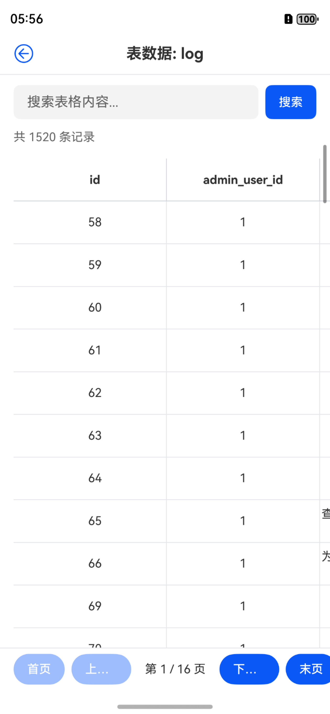
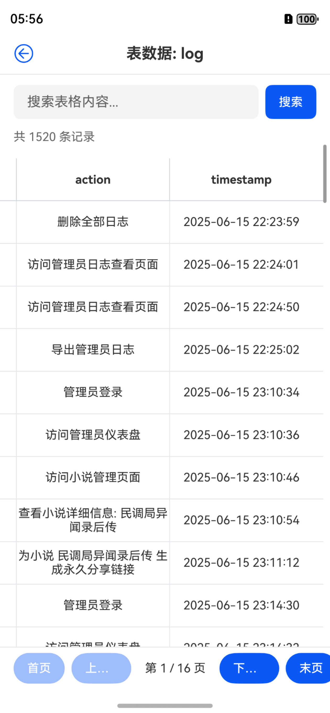
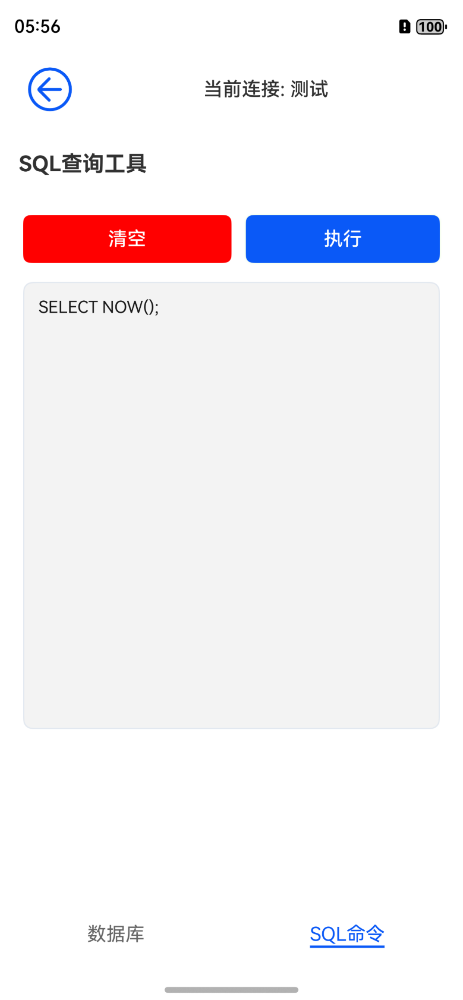
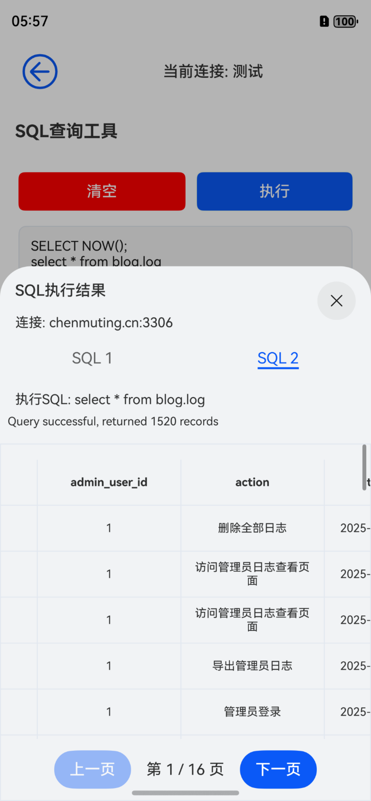

# MyLite

## 应用详情

一款轻量实用的鸿蒙版 MySQL 连接工具，帮你轻松搞定跨设备数据库管理。

### 主要特性

*   支持自行搭建后端服务器，连接 MySQL 数据库

*   支持手机、平板、电脑等鸿蒙设备

*   操作简单，无需复杂设置，上手即用

## UI 界面

以下是 MyLite 应用的主要界面展示：

### 首页界面

*图 1：MyLite 应用首页，显示 "MySQL 连接管理工具" 标题，包含 "首页" 和 "设置" 入口*

### 新建连接界面

*图 2：新建 MySQL 连接界面，支持输入连接名称、主机地址、用户名、密码及端口（默认 3306），提供 "取消" 和 "测试并保存" 功能按钮*

### 数据库列表界面

*图 3：显示当前连接状态（测试）及数据库列表（blog、information\_schema、mysql 等），包含 "数据库" 和 "SQL 命令" 切换入口*

### 数据表列表界面

*图 4：展示当前数据库（blog）包含的数据表（admin\_online\_status、admin\_user、alembic\_version 等），支持 "新建表" 操作*

### 表数据查看（基础列）

*图 5：log 表数据展示（id、admin\_user\_id 列），支持搜索功能，显示共 1520 条记录及分页导航（第 1/16 页）*

### 表数据查看（详情列）

*图 6：log 表数据详情展示（action、timestamp 列），包含具体操作记录及时间信息*

### SQL 查询编辑界面

*图 7：SQL 查询工具界面，支持输入 SQL 语句（如 SELECT NOW ()），提供 "清空" 和 "执行" 功能按钮*

### SQL 执行结果界面

*图 8：SQL 语句执行结果展示，显示连接信息、执行的 SQL 语句及返回的 1520 条记录，支持分页查看*